<div align="center">

# Releve

Price your Claude Code transcripts at real API rates

[![Live][badge-site]][url-site]
[![HTML5][badge-html]][url-html]
[![CSS3][badge-css]][url-css]
[![JavaScript][badge-js]][url-js]
[![Claude Code][badge-claude]][url-claude]
[![License][badge-license]](LICENSE)

[badge-site]:    https://img.shields.io/badge/live_site-0063e5?style=for-the-badge&logo=googlechrome&logoColor=white
[badge-html]:    https://img.shields.io/badge/HTML5-E34F26?style=for-the-badge&logo=html5&logoColor=white
[badge-css]:     https://img.shields.io/badge/CSS3-1572B6?style=for-the-badge&logo=css3&logoColor=white
[badge-js]:      https://img.shields.io/badge/JavaScript-F7DF1E?style=for-the-badge&logo=javascript&logoColor=black
[badge-claude]:  https://img.shields.io/badge/Claude_Code-CC785C?style=for-the-badge&logo=anthropic&logoColor=white
[badge-license]: https://img.shields.io/badge/license-MIT-404040?style=for-the-badge

[url-site]:   https://releve.neorgon.com/
[url-html]:   #
[url-css]:    #
[url-js]:     #
[url-claude]: https://claude.ai/code

</div>

---

## Overview

Releve reads the transcripts Claude Code already writes to `~/.claude/projects/`
and tells you what that work would have cost billed by the token. Run one Python
script, drop the file it writes onto the site, and you get cost by model, project,
skill and effort; a cache lab that shows how much the prompt cache actually saved;
a repo scanner that prices a codebase against each model's context window; and a
projector that forecasts the next stretch of work from your own measured medians.
Every rate is editable on the page, and the pricing engine is implemented twice,
in Python and in JavaScript, asserted against the same 49-case fixture, so a
figure from the script and a figure from the browser are the same calculation.

> Not affiliated with Anthropic. Claude and Claude Code are their marks. Every
> dollar here is tokens multiplied by a published list rate: it is what the same
> work would have cost through the API, not what any invoice says.

**Live:** releve.neorgon.com

---

## Features

- **Statement** -- API-equivalent cost and your plan cost side by side, with the multiple between them, over any window
- **Timeline** -- daily, weekly or monthly cost stacked by model; pick a window and every section below recomputes
- **Breakdowns** -- the same total cut eight ways: model, project, skill, effort, branch, lane (main thread against subagent), service tier and Claude Code version; click a row to filter the page by it
- **Cache lab** -- fresh input, five-minute writes, one-hour writes and reads priced separately, plus what the cache saved measured against repricing every read as fresh input
- **Repo scanner** -- point at a folder or drop a `releve-repo.json` to see tokens by language, priced, and what share of each model's context window the tree fills
- **Projector** -- sliders for iterations, turns per iteration, cache hit ratio and the share of writes at the one-hour TTL, calibrated from the loaded dataset, with a sensitivity ranking that says which lever actually moves the bill
- **Editable rate card** -- 14 models with dated price periods; change a rate and the whole page recomputes from tokens
- **Method, in full** -- the six pricing rules, what the dataset says about its own reliability, every stated limit, and a live parity check against the fixture
- **Nothing is uploaded** -- the published dataset is synthetic; your own file is read with the File API and never leaves the machine

---

## The six pricing rules

The engine exists because the obvious reading of a transcript is wrong in six
specific ways. Each rule is pinned by fixture cases in `data/testcases.json`.

| | Rule |
|---|---|
| 1 | Resolve rates **per turn**, from that turn's own `message.model`. A session that switched models mid-way is not priced by whichever model was last in the file. |
| 2 | **Never substitute another model's rates.** Exact id, then longest declared prefix or suffix, then *unpriced*. An unpriced model is named and counted in its own bucket, never folded into a total and never rendered as zero. |
| 3 | **Split the cache writes.** Five-minute writes bill at 1.25x base input, one-hour writes at 2x. A turn carrying only the flat counter is assumed five-minute and flagged as an assumption. |
| 4 | **Honour `usage.speed`.** Fast mode on Opus bills double, so a fast session must not be priced as standard. |
| 5 | A non-empty `usage.iterations` **replaces** the top-level counters and is never added to them. Adding double-counts; ignoring the array under-reports every multi-iteration turn. |
| 6 | **Count each response once, keyed on `message.id`**, not on the entry's `uuid`. A response is written one entry per content block and every entry repeats the same `usage`, so a turn that thought, spoke and called a tool appears three times and is billed once. |

Rule 6 is the one that decides whether the answer is right or roughly triple: on
the author's machine 116,402 entries are 52,078 responses, and the per-`uuid`
reading reports 30.0B cache-read tokens against a true 12.9B.

---

## The scripts

Python 3, standard library only, no network calls unless you ask for them. Each
one prints the date of the rates it used.

```bash
# one number
curl -O https://releve.neorgon.com/scripts/releve-mini.py
python3 releve-mini.py --days 30

# the full scan, which writes the file the site loads
curl -O https://releve.neorgon.com/scripts/releve-scan.py
curl -O https://releve.neorgon.com/scripts/releve_cost.py
python3 releve-scan.py --days 30 --out releve.json      # add --anonymize before sharing

# count and price a codebase, or project work forward from a scan
curl -O https://releve.neorgon.com/scripts/releve-repo.py
curl -O https://releve.neorgon.com/data/tokenizer.json
python3 releve-repo.py . --out releve-repo.json
python3 releve-repo.py . --project --iterations 40 --from releve.json
```

`--anonymize` hashes project labels to stable `proj-a1b2` tokens and drops `cwd`,
`gitBranch`, `title` and `slug`. No output from any script ever contains prompt or
response text: only usage counters and labels.

---

## How accurate is the repo count

Character counts divided by a per-language factor, because `tiktoken` is an OpenAI
tokenizer and does not describe Claude's. The factors in `data/tokenizer.json` are
measured, not guessed: an assistant response is written one entry per content
block, all sharing a `message.id`, so reassembling those blocks recovers exactly
the characters its `output_tokens` paid for. Fitted over 28,698 responses, the
table predicts a whole response to a median 20.7% error (p25 12.3%, p75 28.4%).

What that does not check is the absolute level, since every factor comes from
output tokens and a bias common to all of them would not show up.
`releve-repo.py --tokenizer api` counts exactly through
`/v1/messages/count_tokens` and settles it; `--calibrate` refits the table on your
own transcripts and prints the error it achieves.

---

## Running locally

ES modules require an HTTP server (not `file://`):

```bash
make serve          # http://localhost:8874
```

The published dataset is synthetic. To see your own numbers on localhost:

```bash
make mine           # writes data/local.json, which is gitignored
```

`js/ingest.js` prefers `data/local.json` when it exists and falls back to
`data/demo.json`, so real numbers on localhost and synthetic numbers in public are
one code path.

```bash
make test           # the 49-case fixture plus the embedded rate-table sync check
make parity         # asserts releve-scan.py and releve-mini.py agree to the cent
make demo           # regenerate data/demo.json, with a leak check on the result
```

Run `make test` before any edit to `js/cost.js` or `scripts/releve_cost.py`. The
site runs the same fixture in the browser and prints the verdict in section 8.

---

## Architecture



```
releve-site/
├── index.html                  # shell, SEO head, JSON-LD, the eight section anchors
├── css/
│   └── style.css               # --accent: #ca8a04
├── js/
│   ├── app.js                  # entry point: ingest, then render, then bind
│   ├── state.js                # dataset, filters, plan cost, rate overrides (localStorage)
│   ├── ingest.js               # local.json, else demo.json, else a dropped file
│   ├── cost.js                 # THE PRICING ENGINE, twin of scripts/releve_cost.py
│   ├── rates.js                # resolve a rate by model and date, apply user overrides
│   ├── filters.js              # date, project, model, skill, effort, lane
│   ├── render.js               # section orchestration
│   ├── widgets/                # one module per section (kpi, timeline, breakdown,
│   │                           #   cache, repo, projector, ratecard, method)
│   ├── events.js               # every listener; no inline onclick
│   └── utils.js                # formatting helpers, NO_VALUE
├── data/
│   ├── rates.json              # releve-rates/v1: 14 models, dated periods
│   ├── tokenizer.json          # releve-tokenizer/v1: measured chars-per-token factors
│   ├── testcases.json          # the 49 cases both engines are asserted against
│   └── demo.json               # synthetic, shaped like the real distributions
├── scripts/
│   ├── releve_cost.py          # THE PRICING ENGINE, twin of js/cost.js
│   ├── releve-mini.py          # one number
│   ├── releve-scan.py          # the full scan, writes releve.json
│   ├── releve-repo.py          # repo counter and iteration projector
│   ├── test_cost.py            # asserts the Python engine against testcases.json
│   └── make-demo.py            # regenerates data/demo.json
├── docs/architecture.{mmd,svg}
├── Makefile
└── README.md
```

The two engine files are the point of the layout. They implement the same rules in
two languages and are asserted against the same fixture, and the site reports the
result of that check in section 8. If the two ever disagree about money, every
other number on the page is unverified and the page says so.

---

<div align="center">
<sub>Part of <a href="https://neorgon.com/">Neorgon</a></sub>
</div>
